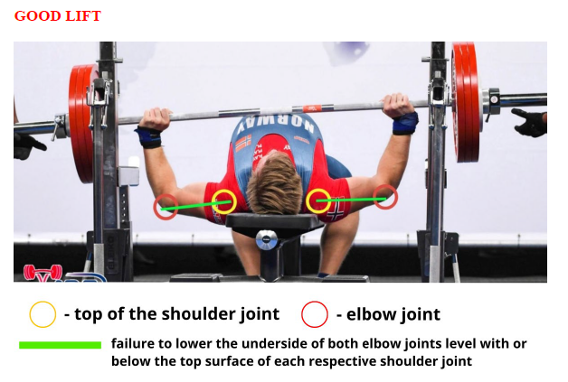
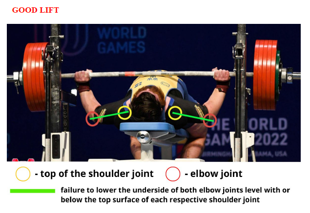
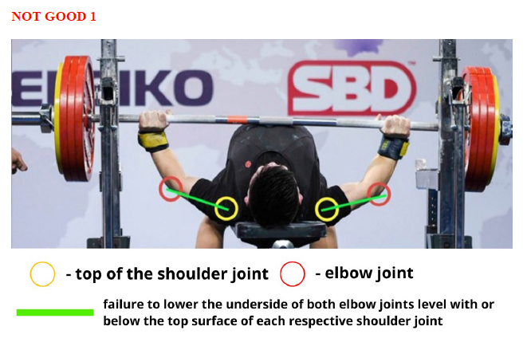
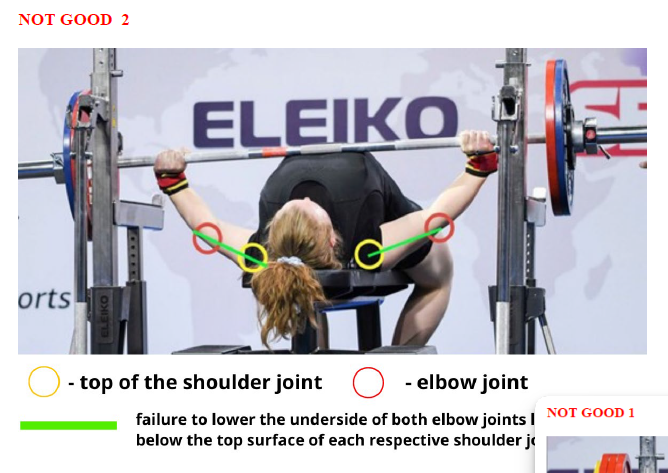

# Depth Tracking

Notes and restrictions for depth tracking

## Administration

### Bench Requirements

* Length - not less than 1.22 m `length > 122`
* Width - not less than 29 cm and not exceeding 32 cm `29 > width > 32`
* Height - not less than 42 cm and not exceeding 45 cm measured from the floor to the top of the padded surface `42 > height > 45`

### Lights
A system of lights shall be provided whereby the referees make known their decisions. Each referee will control a white and a red light. These two colors represent a “good lift” and “no lift” respectively. The lights shall be arranged horizontally to correspond with the positions of the three referees.
`white_light = "good lift"` and `red_light = "no lift"`

#### Failure Cards
After the lights have been activated and appeared, the referee(s) will raise a card or paddle or activate a light system to make known the reason/s why the lift has been failed.


```C++
if (red_light) {
    Case (red_card){...}
    Case (blue_card){...}
    Case (yellow_card){...}
}
```

## Squat Rules
1. The lifter shall face the front of the platform. The bar shall be held horizontally across the shoulders, hands and fingers gripping the bar. The hands may be positioned anywhere on the bar inside and or in contact with the inner collars.
2. After removing the bar from the racks, (the lifter may be aided in removal of the bar from the racks by the spotter / loaders) the lifter must move backwards to establish the starting position. When the lifter is motionless, erect (slight deviation is allowable) with knees locked the Chief Referee will give the signal to begin the lift. The signal shall consist of a downward movement of the arm and the audible command “Squat”. Before receiving the signal to “squat” the lifter may make any position adjustments within the rules, without penalty. For reasons of safety the lifter will be requested to “Replace” the bar, together with a backward movement of the arm, if after a period of five seconds he is not in the correct position to begin the lift. The Chief Referee will then convey the reason why the signal was not given.
3. Upon receiving the Chief Referee’s signal the lifter must bend the knees and lower the body until the top surface of the legs at the hip joint is lower than the top of the knees. Only one decent attempt is allowed. The attempt is deemed to have commenced when the lifters knees have unlocked.
4. The lifter must recover at will to an upright position with the knees locked. Double bouncing at the bottom of the squat attempt or any downward movement is not permitted. When the lifter is motionless (in the apparent final position) the Chief Referee will give the signal to rack the bar.
5. The signal to rack the bar will consist of a backward motion of the arm and the audible command “Rack”. The lifter must then return the bar to the racks. Foot movement after the rack signal will not be cause for failure. For reasons of safety the lifter may request the aid of the spotter/loaders in returning the bar to, and replacing it in the racks. The lifter must stay with the bar during this process.
6. Not more than five and not less than two spotter/loaders shall be on the platform at any time. The Referees may decide to the number of spotter/loaders required on the platform at any time 2, 3, 4, or 5.

### Causes for Disqualification
1. Failure to observe the Chief Referee’s signals at the commencement or completion of a lift.
2. Double bouncing at the bottom of the lift, or any downward movement during the ascent.
3. Failure to assume an upright position with the knees locked at the commencement or completion of the lift.
4. Stepping backward or forward or moving the feet laterally. Rocking the feet between the ball and heel is permitted.
5. Failure to bend the knees and lower the body until the top surface of the legs at the hip joint is lower than the top of the knees, as in the diagram.
6. Contact with the bar or the lifter by the spotter/loaders between the Chief Referee’s signals in order to make the lift easier.
7. Contact of the elbows or upper arms with the legs. Slight contact is permitted if there is no supporting that might aid the lifter.
8. Any dropping or dumping of the bar after completion of the lift.
9. Failure to comply with any of the items outlined under Rules of Performance for the squat.


## Squat

### Red card
* Failure to bend the knees and lower the body until the top surface of the legs at the hip joint is lower than the top of the knees.

### Blue card
* Failure to assume an upright position with the knees locked at the commencement and at the completion of the lift.
* Double bouncing or more than one recovery attempt at the bottom of the lift or any downward movement during the ascent.

### Yellow Card
* Stepping backward or forward or moving the feet laterally. Rocking the feet between the ball and heel is permitted.
* Failure to observe the Chief Referees signals at the commencement or completion of the lift.
* Contact with bar or lifter by the spotters/loaders between the Chief referees’ signals, in order to make the lift easier.
* Contact of elbows or upper arms with the legs, which has supported and been of aid to the lifter. Slight contact that is of no aid may be ignored.
* Any dropping or dumping of the bar after completion of the lift.
* Failure to comply with any of the requirements contained in the general description of the lift, which precedes this list of disqualification.
* Incomplete lift


## Bench
stretch goal

### Good lift examples


 


### Bad lift examples




### Red card
### Blue card
### Yellow card

## Deadlift
stretch goal

### Red card
### Blue card
### Yellow card


## Source

[IPF Technical Rules 2023](https://www.powerlifting.sport/fileadmin/ipf/data/rules/technical-rules/english/IPF_Technical_Rules_Book_2023__1_.pdf)


